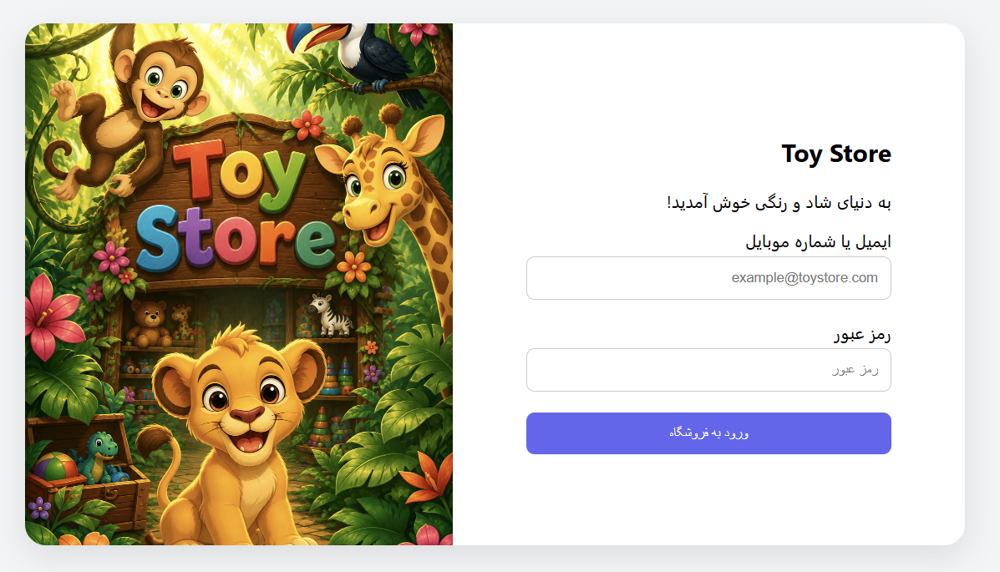

# Login Page (Toy Store)

A simple and responsive login page designed for a toy store using basic web technologies.

## 🛠 Tech Stack
- HTML5
- CSS3
- JavaScript (Vanilla)

## ✨ Features
- **Responsive Design:** Works perfectly on mobile, tablet, and desktop.
- **Attractive UI:** Designed specifically for a toy store theme.
- **Form Validation:** Basic JavaScript validation for user inputs.

## 🚀 How to Run
1. Clone this repository:
   `git clone https://github.com/sdfmoghadam-dev/login-page.git`
2. Open `index.html` in your browser.

## 📷 Preview

